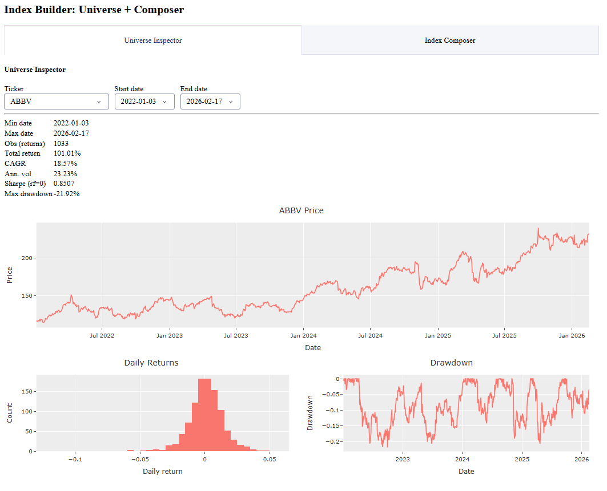
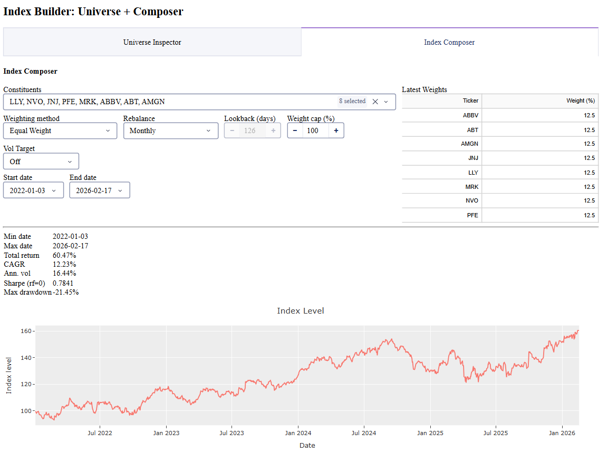
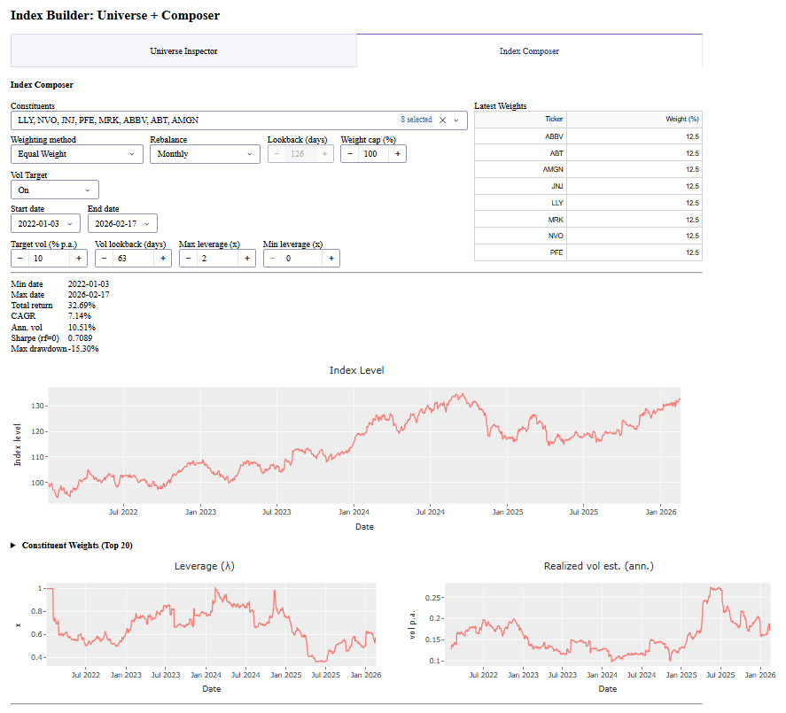

# index-creator

A minimal Dash app to **inspect a ticker universe** and **compose simple research indices** (equal-weight / price-weight / inverse-vol), with an optional **vol-target overlay**.

This repository is maintained as part of a broader, practical research effort on **digitalization capacities in finance**: how quickly we can go from market data → transparent rules → reproducible index prototypes.

---

## Quick start (uv)

### 1) Create environment + install deps
```bash
uv venv
uv sync
```

### 2) Run the app
```bash
uv run index_builder
```

This runs `main:main` via the script entrypoint configured in `pyproject.toml`.

Open:
- http://127.0.0.1:8050

---


## What the app does

### Universe Inspector
- Pick a ticker
- View price, returns histogram, drawdown
- See compact stats (CAGR, vol, Sharpe, max drawdown)



### Index Composer
- Select constituents (multi-select)
- Choose weighting method + rebalance frequency
- Optional weight cap
- Optional vol targeting (shows extra controls only when enabled)

📸 Vol Target **Off**: 
📸 Vol Target **On**: 

---

## Data + caching

<div style="background:#1e73be;color:#ffffff;padding:12px 14px;border-radius:10px;line-height:1.35;">
  <div style="font-size:16px;font-weight:700;margin-bottom:6px;">🧊 Yahoo Finance, with respect 🙏</div>
  We use <b>local caching</b>, <b>batching</b>, and small <b>delays</b> when downloading data — because we deeply respect the Yahoo Finance folks and don’t want to slow them down. 💙
</div>

- Loader: `index_lib.loaders.load_universe_close_volume_cached(...)`
- Cache folder: `data/` (Parquet / metadata)

---

## Configuration (where to edit)

### Universe
Edit the list in `main.py`:
- `DEFAULT_UNIVERSE = ...`

### Default basket
In `main()`:
- `default_pick = [...]`

### Vol targeting defaults
In `apply_vol_target_overlay()`:
- `target_vol_ann` (e.g., 0.10)
- `vol_lookback` (e.g., 63)
- `max_leverage`, `min_leverage`

---

## Code map (high-level)

- `main.py` — Dash UI + callbacks + index calculations
- `index_lib/` — loaders and helper utilities
- `data/` — cached market data
- `docs/screenshots/` — screenshots referenced above

---

## Notes
This is a research prototype: it focuses on clarity and iteration speed (not a full production index rulebook).
