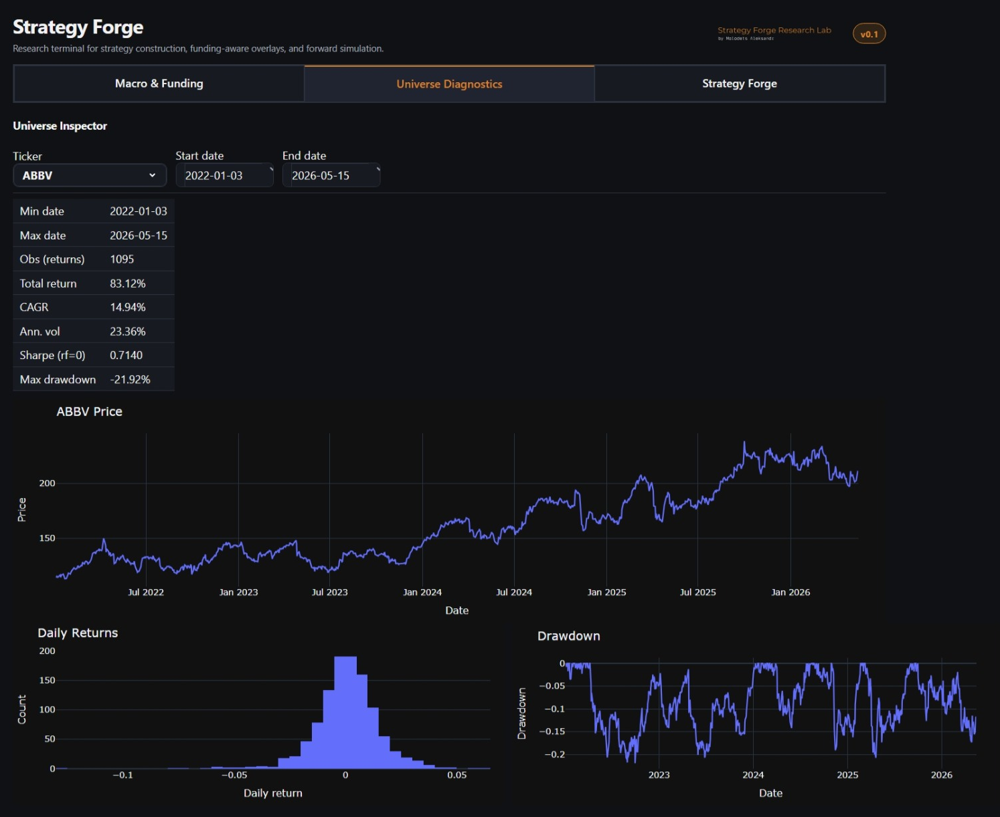
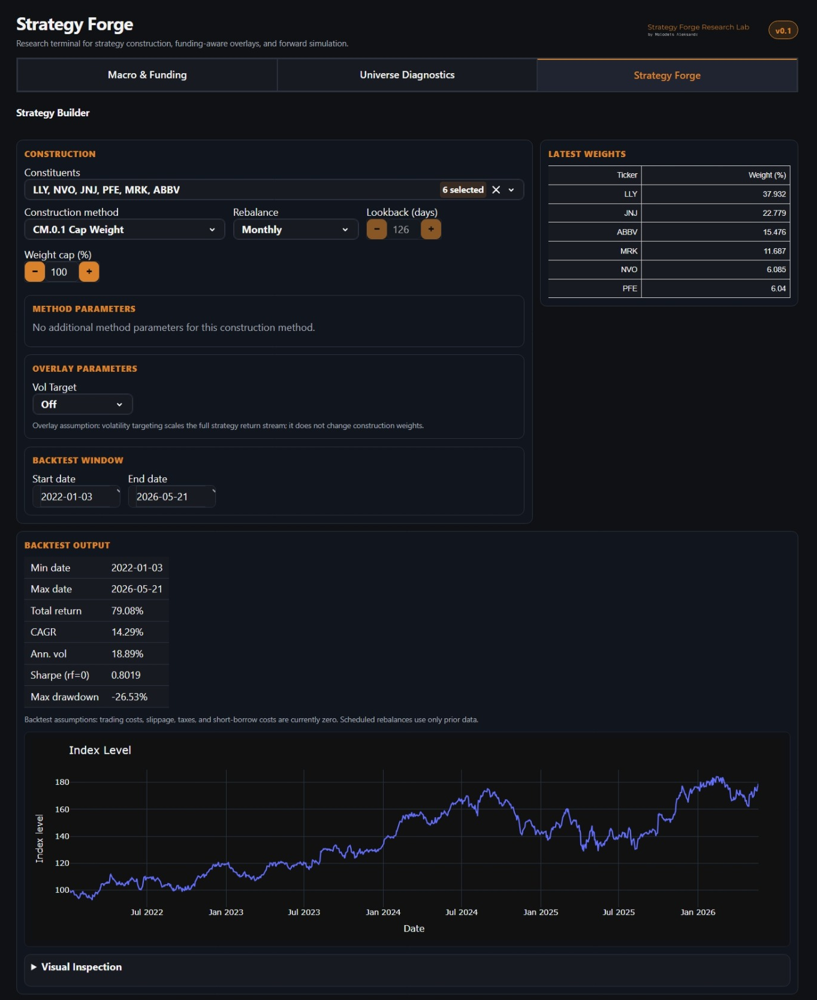
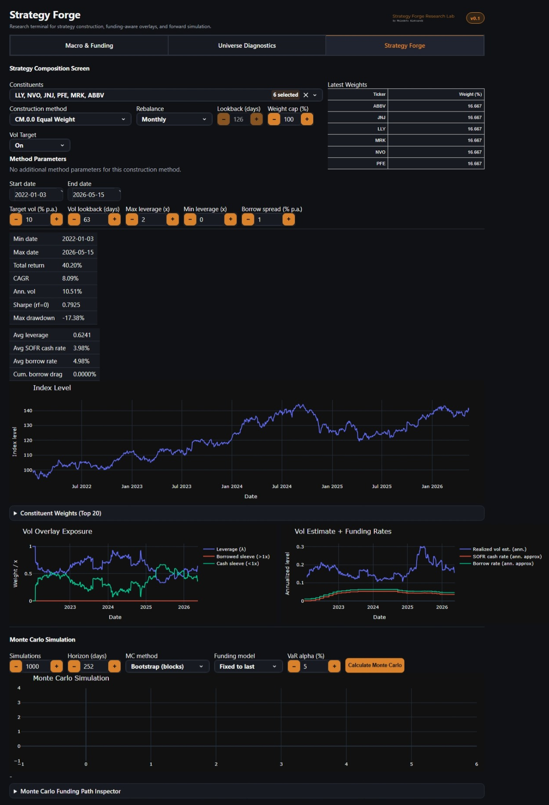
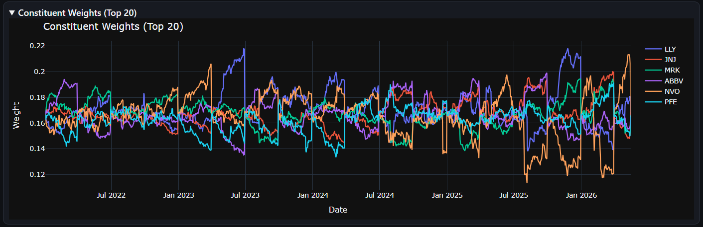
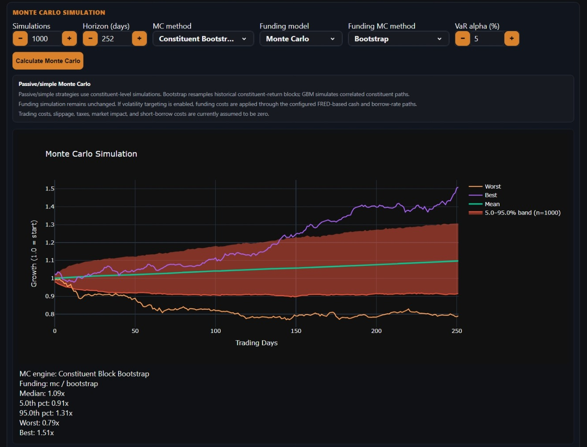

# index-creator

A minimal Dash app to **inspect a ticker universe** and **compose simple research indices** (equal-weight / price-weight / inverse-vol), with an optional **vol-target overlay**.

This repository is maintained as part of a broader, practical research effort on **digitalization capacities in finance**: how quickly we can go from market data → transparent rules → reproducible index prototypes.

---

## Quick start (uv)

### 1) Create environment + install deps

```powershell
uv venv
uv sync
```

### 2) Run the app

```powershell
uv run index_builder
```

This runs `main:main` via the script entrypoint configured in `pyproject.toml`.

Open:
- http://127.0.0.1:8050

---


## What the app does

### Universe Inspector
- Pick a ticker
- View price, returns histogram, drawdown
- See compact stats (CAGR, vol, Sharpe, max drawdown)



### Index Composer
- Select constituents (multi-select)
- Choose weighting method + rebalance frequency
- Optional weight cap
- Optional vol targeting (shows extra controls only when enabled)

📸 Vol Target **Off**: 
📸 Vol Target **On**: 

### Weight Evolution (Debug View)

The **“Constituent Weights (Top 20)”** graph is intentionally kept as a debugging and validation instrument.

Below we present the example of the weight inspector functionality for quarterly rebalancing of equal weight index: one can notice that the weights equalize once a quarter:

It plots **daily drifted weights**, not only rebalance weights.  
This allows verification of:

- Proper weight reset on rebalance dates
- Correct daily weight drift between rebalances
- Correct enforcement and redistribution of weight caps
- Correct behavior across weighting methodologies

This graph was instrumental in validating the equal-weight methodology correction (see Version Log).

### Monte Carlo Simulation

The Monte Carlo Simulation module enables forward-looking scenario
analysis of a composed index under stochastic return assumptions.



Monte Carlo simulates many possible future paths and re-applies the **exact
same index construction logic**:

- Constituent return simulation  
- Dynamic rebalancing  
- Weight caps  
- Daily weight drift  
- Optional volatility targeting  

Two **simulation engines** are available:

#### 1) Block Bootstrap (default)

Returns are generated by sampling contiguous blocks of historical
returns. This preserves:

- Cross-asset correlation  
- Volatility clustering  
- Empirical distribution shape  
- Tail behavior observed in history  

This is the default method.


#### 2) Correlated GBM

Returns are generated from a multivariate Geometric Brownian Motion
estimated from historical log-returns. This produces smooth,
correlated stochastic paths based on estimated drift and covariance.

This method assumes approximate log-normal dynamics.

#### Configuration

In the Monte Carlo panel:

- **Simulations** — number of simulated paths  
- **Horizon (days)** — forward simulation length  
- **MC Method** — Bootstrap (default) or GBM  
- **VaR alpha (%)** — percentile band width  

If Vol Targeting is enabled in the Index Composer, the same overlay
logic is applied within each simulated path.

#### Output

The simulation graph displays:

- Mean path  
- Best path  
- Worst path  
- Alpha-based percentile band (e.g., 5%–95%)

Below the chart:

- Median terminal value  
- Lower percentile terminal value  
- Upper percentile terminal value  
- Best terminal value  
- Worst terminal value  

All paths are shown in **growth space (1.0 = start)**.

---

<details>
<summary><strong>Methodology Details (click to expand)</strong></summary>

<br>

### Block Bootstrap

Let daily historical returns be $r_t$ in $R^N$.

Blocks of length $L$ are sampled and concatenated to build a horizon of length $H$:

$r_{t_1}, …, r_{t_1+L-1}, r_{t_2}, …$

Portfolio return:

$R_t^{port} = w_t^T r_t$

Weights follow the same rebalance and daily drift rules as in the historical engine.

### Correlated GBM

Log-returns:

$x_t = \log(1 + r_t)$

Estimate:

$\mu = E[x_t]$  
$\Sigma = Cov(x_t)$

Simulated log-returns:

$x_t^{sim} = (\mu - 0.5 \, diag(\Sigma)) + L z_t$

where $z_t \sim N(0, I)$ and $L$ is the Cholesky factor of $\Sigma$.

Arithmetic returns:

$r_t^{sim} = \exp(x_t^{sim}) - 1$

### Volatility Target Overlay

Leverage:

$\lambda_t = \sigma_{target} / \hat{\sigma}_{t-1}$

Clipped to $[min\ leverage, max\ leverage]$

Adjusted return:

$R_t^{VC} = \lambda_t R_t^{port}$

</details>

---

## Data + caching

<div style="background:#1e73be;color:#ffffff;padding:12px 14px;border-radius:10px;line-height:1.35;">
  <div style="font-size:16px;font-weight:700;margin-bottom:6px;">🧊 Yahoo Finance, with respect 🙏</div>
  We use <b>local caching</b>, <b>batching</b>, and small <b>delays</b> when downloading data — because we deeply respect the Yahoo Finance folks and don’t want to slow them down. 💙
</div>

- Loader: `index_lib.loaders.load_universe_close_volume_cached(...)`
- Cache folder: `data/` (Parquet / metadata)

---

## Configuration (where to edit)

### Universe
Edit the list in `main.py`:
- `DEFAULT_UNIVERSE = ...`

### Default basket
In `main()`:
- `default_pick = [...]`

### Vol targeting defaults
In `apply_vol_target_overlay()`:
- `target_vol_ann` (e.g., 0.10)
- `vol_lookback` (e.g., 63)
- `max_leverage`, `min_leverage`

---

## Code map (high-level)

- `main.py` — Dash UI + callbacks + index calculations
- `index_lib/` — loaders and helper utilities
- `data/` — cached market data
- `docs/screenshots/` — screenshots referenced above

---

## Version Log

### 2026-03-01
**Community suggestion: Monte-Carlo simulation framework (optimized)**

In order to increase the speed of calculations, new vectorized simulation methodology is used. The robustness is being tested.

### 2026-02-25
**Monte-Carlo simulation framework (slow)**

For the robustness of model, the Monte-Carlo simulation was implemented, which simulates constituent's returns, then simulates rebalancing and overlay per path. The method is built upon normal dist sampling, and is not vectorized. The next iteration will use the GBM block bootstrap and will be vectorized - to ensure execution speed (currently around 3 min per run with default parameters)

### 2026-02-20

**Equal-weight methodology correction.**

Previously, the equal-weight implementation effectively behaved as if weights were fixed over time.  
This was inconsistent with the intended framework:

- Periodic rebalancing
- Daily drift between rebalances

Correction implemented:

- Equal weights now reset strictly on rebalance dates.
- Daily drift is properly applied between rebalances.
- Debug weight graph now reflects actual weight evolution.
- Methodology aligned structurally with price-weight and inverse-vol logic.

This materially improves correctness and transparency of the backtest engine.

### 2025-02-18

Baseline version prior to equal-weight correction.

---

## Notes

This is a research prototype: it focuses on clarity and iteration speed (not a full production index rulebook).
