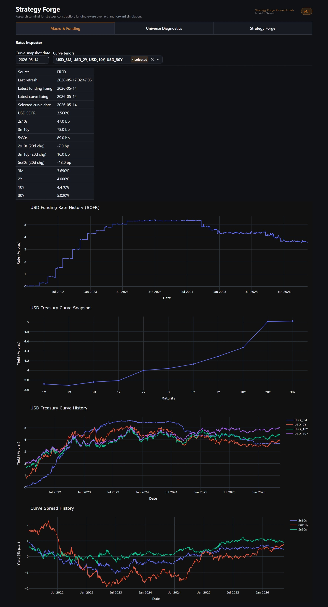
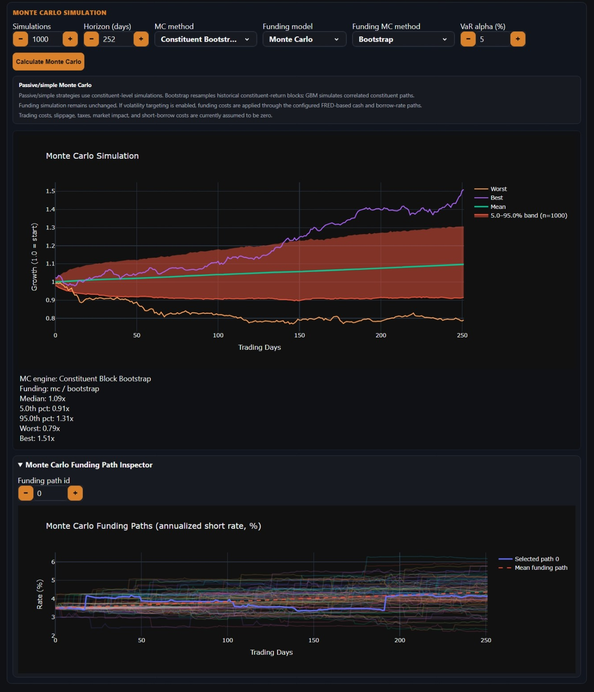

# index-creator

A minimal Dash app to **inspect a ticker universe** and **compose research-grade indices**  
(equal-weight / price-weight / inverse-vol), with an optional **funding-aware volatility targeting overlay**.

This repository is part of a broader, practical research effort on:

> **digitalization capacities in finance** —  
> how fast we can go from **market data → transparent rules → reproducible index prototypes**

---

# 🚀 Quick Start

## 1) FRED API setup (Rates module)

The **Rates Inspector** and **funding-aware overlay** require data from FRED.

### Get API key
- https://fred.stlouisfed.org/
- Create account
- Generate key

### Create `.env`
```bash
FRED_API_KEY=your_api_key_here
```

⚠️ **Security**
- `.env` is ignored via `.gitignore`
- Never commit API keys
- Treat it like a password

---

## 2) Install

```bash
uv venv
uv sync
```

---

## 3) Run

```bash
uv run index_builder
```

Open:
http://127.0.0.1:8050

---

# 🧭 What the App Does

The application consists of four tightly connected layers:

1. **Rates Inspector** — macro + funding layer  
2. **Universe Inspector** — single-asset diagnostics  
3. **Index Composer** — portfolio construction engine  
4. **Monte Carlo Engine** — forward simulation  

---

# 📊 Rates Inspector



## Functionality

- SOFR funding rate history  
- Full US Treasury curve (1M → 30Y)  
- Curve snapshots  
- Curve spread analysis  

## Analytical use cases

- Monetary policy regime detection  
- Curve inversion / steepening  
- Funding environment analysis  
- Macro overlay intuition  

---

## ⚠️ Integration into Portfolio Mechanics

Rates are not just visual anymore.

They are directly integrated into:

### Historical backtests
- Cash sleeve earns SOFR  
- Leveraged sleeve pays SOFR + spread  

### Monte Carlo simulation
- Same funding logic applied per simulated path  
- Optional stochastic rate generation  

---

# 📈 Universe Inspector


## Features

- Price time series  
- Return distribution (histogram)  
- Drawdown profile  
- Performance statistics  

## Statistics computed

- Total return  
- CAGR  
- Annualized volatility  
- Sharpe ratio  
- Max drawdown  

---

# 🧩 Index Composer

  


## Core functionality

### Portfolio construction
- Multi-asset selection  
- Flexible weighting schemes  

### Weighting methods
- Equal Weight  
- Price Weight  
- Inverse Volatility  

### Rebalancing
- Daily  
- Weekly  
- Monthly  
- Quarterly  

### Constraints
- Weight caps  
- Automatic redistribution  

---

## 💰 Funding-aware Volatility Targeting

When enabled, the overlay becomes economically realistic.

### Mechanics

- λ < 1 → residual capital earns cash carry  
- λ > 1 → leveraged capital pays funding cost  

### User input
- Borrow spread  

---

# ⚖️ Weight Evolution (Debug Layer)


## Purpose

Explicit validation of index mechanics:

- Rebalance correctness  
- Daily drift  
- Cap enforcement  
- Method consistency  

---

# 🎲 Monte Carlo Simulation


## Purpose

Forward simulation with **full reapplication of index logic**.

---

## What is simulated

- Asset returns  
- Rebalancing  
- Weight drift  
- Vol targeting  
- Funding overlay  

---

## Engines

### Block Bootstrap (default)

Preserves:
- Correlation structure  
- Volatility clustering  
- Tail distribution  

---

### Correlated GBM

- Parametric  
- Smooth  
- Fast  

---

# 💸 Funding Modelling

Two independent stochastic layers:

## Asset process
- Bootstrap  
- GBM  

## Funding process
- Fixed  
- OU  
- Bootstrap  

---

## OU Model

Mean-reverting short-rate process estimated from SOFR.

---

## Bootstrap Rates

Empirical rate shocks preserved.

---

## Decoupling

Return process and funding process are independent:

- GBM + OU  
- Bootstrap + Bootstrap  
- etc.  

---

# 🔍 Funding Path Inspector



## Capabilities

- Inspect simulated paths  
- Compare to mean  
- Validate process behaviour  

---

# ⚙️ Methodology

## Portfolio return

$$
R_t^{port} = w_t^T r_t
$$

---

## Volatility targeting

$$
\lambda_t = \frac{\sigma_{target}}{\hat{\sigma}_{t-1}}
$$

---

## Funding-aware overlay

$$
R_t^{VC} =
\lambda_t R_t^{port}
+ \max(1-\lambda_t,0) r_t^{cash}
- \max(\lambda_t-1,0) r_t^{borrow}
$$

---

## GBM

$$
x_t = \log(1 + r_t)
$$

$$
x_t^{sim} = (\mu - 0.5 \cdot diag(\Sigma)) + L z_t
$$

$$
r_t^{sim} = e^{x_t^{sim}} - 1
$$

---

## Bootstrap

Block sampling:

$$
r_{t_1}, …, r_{t_1+L-1}, r_{t_2}, …
$$

---

# 📦 Data & Caching

## Stocks
- Yahoo Finance  
- Local caching  

## Rates
- FRED  
- Cached  

---

# ⚙️ Configuration

- Universe → main.py  
- Overlay → apply_vol_target_overlay  
- Funding → MC functions  

---

# 📜 Version Log

## 2026-03-28
Funding-aware overlay + MC funding

## 2026-03-18
Rates Inspector

## 2026-03-01
Vectorized Monte Carlo

## 2026-02-20
Equal-weight correction

---

# 🧠 Notes

This is a **research prototype**:

- clarity > abstraction  
- speed > perfection  
