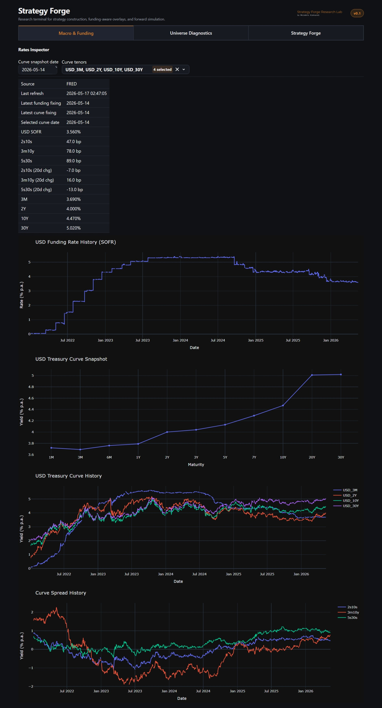
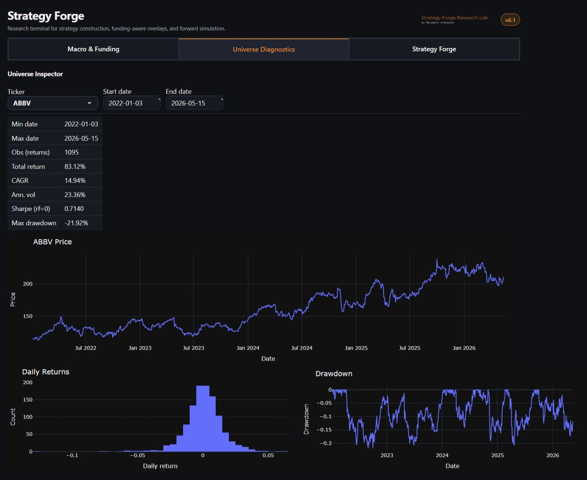
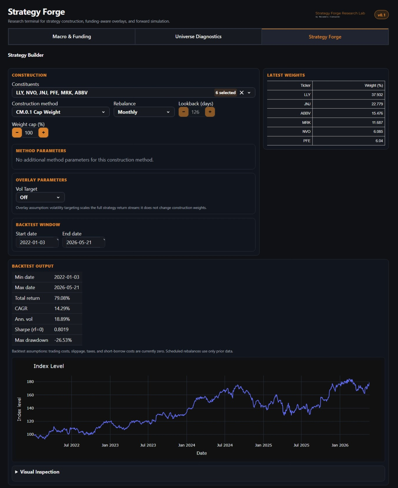
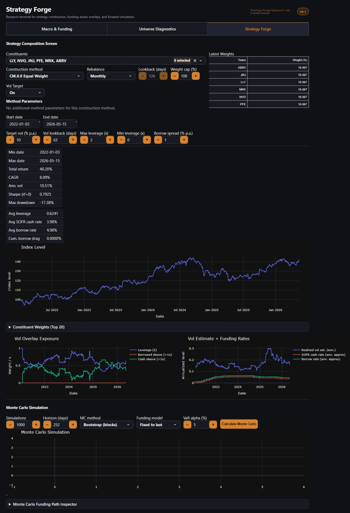
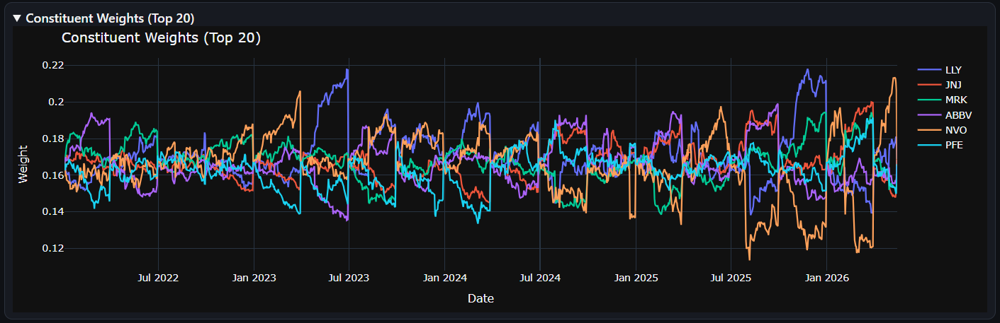
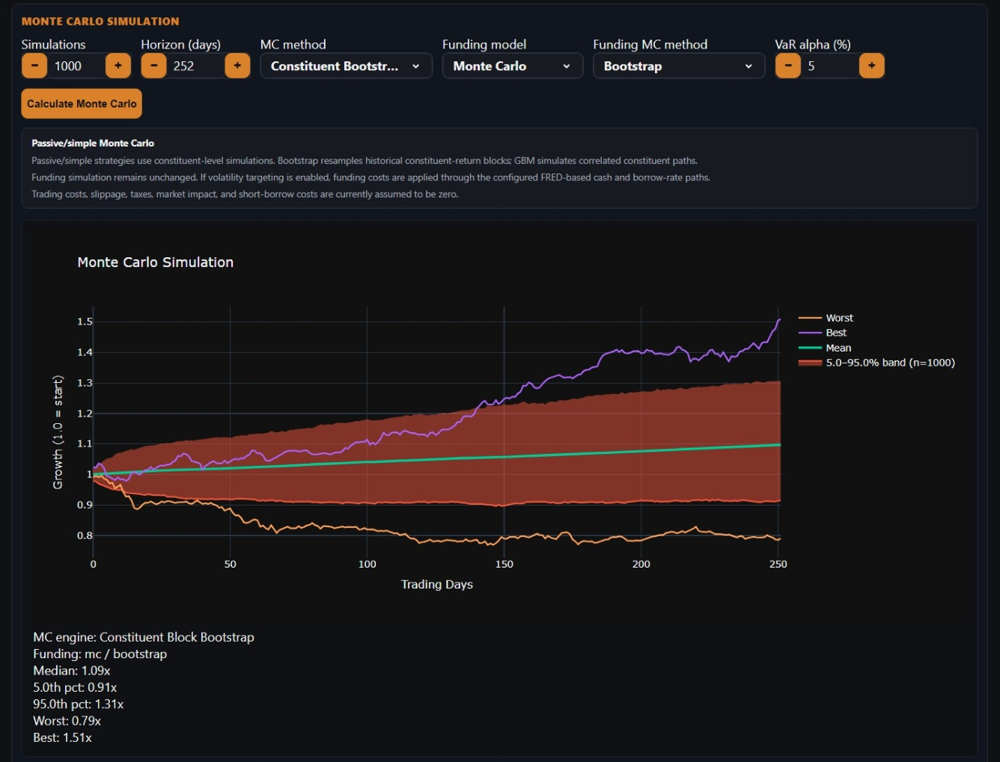
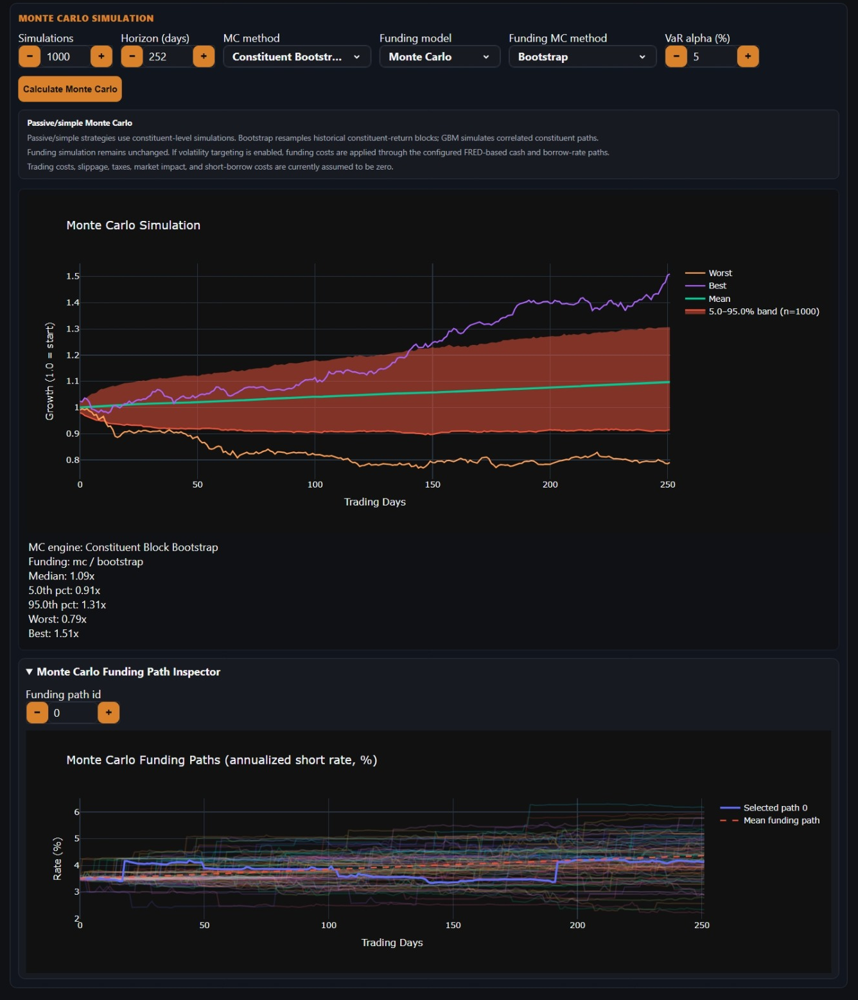

# Strategy Forge

A Streamlit-based research prototype for **strategy construction, passive index logic, PM-classic portfolio methods, funding-aware overlays, and forward simulation**.

The current version supports universe inspection, strategy construction, local data caching, cap-weighted balancing, PM-classic optimizers, funding-aware volatility targeting, and method-aware Monte Carlo simulation.

Repository: https://github.com/CalaveraJack/portfolio_balancing

---

# 🚀 Quick Start

## 1) FRED API setup (Rates module)

The **Rates Inspector** and **funding-aware overlay** require data from FRED.

### Get API key
- https://fred.stlouisfed.org/
- Create account
- Generate key

### Create `.env`
```bash
FRED_API_KEY=your_api_key_here
```

⚠️ **Security**
- `.env` is ignored via `.gitignore`
- Never commit API keys
- Treat it like a password

---

## 2) Install

```bash
uv venv
uv sync
```

---

## 3) Run

```bash
uv run streamlit run app.py
```

Open the URL Streamlit prints (by default http://localhost:8501).

### Data mode

The data mode is a sidebar control rather than a command-line flag:

- `refresh` — fetch fresh Yahoo/FRED data, update the local cache, and fail
  loudly if an API is unavailable (the error tells you when a usable cache exists)
- `cache` — never call external APIs, read the local cache only
- `auto` — fetch fresh data first, fall back to the cache if the fresh load fails

**Reload data** in the sidebar clears the caches and reloads under the selected mode.

---

# 🧭 What the App Does

The application consists of four tightly connected layers:

1. **Rates Inspector** — macro + funding layer  
2. **Universe Inspector** — single-asset diagnostics  
3. **Strategy Forge** — passive and PM-classic strategy construction  
4. **Monte Carlo Engine** — method-aware forward simulation  

---

# 📊 Rates Inspector



## Functionality

- SOFR funding rate history  
- Full US Treasury curve (1M → 30Y)  
- Curve snapshots  
- Curve spread analysis  

## Analytical use cases

- Monetary policy regime detection  
- Curve inversion / steepening  
- Funding environment analysis  
- Macro overlay intuition  

---

## ⚠️ Integration into Strategy Mechanics

Rates are directly integrated into strategy mechanics.

### Historical backtests
- Cash sleeve earns SOFR  
- Leveraged sleeve pays SOFR + user-defined borrow spread  

### Monte Carlo simulation
- Same funding logic applied per simulated path  
- Optional stochastic funding-rate generation  

---

# 📈 Universe Inspector



## Features

- Price time series  
- Return distribution  
- Drawdown profile  
- Performance statistics  

## Statistics computed

- Total return  
- CAGR  
- Annualized volatility  
- Sharpe ratio  
- Max drawdown  

---

# 🧩 Strategy Forge

  


## Core functionality

### Strategy construction
- Multi-asset selection  
- Passive construction methods  
- PM-classic optimizer methods  
- Periodic rebalancing  
- Daily weight drift  
- Weight caps  
- Funding-aware overlays  

### Passive methods
- Equal Weight  
- Price Weight  
- Inverse Volatility  
- Cap Weight  

### PM Classics
Available now:
- Minimum Variance  
- Risk Parity / ERC  
- Maximum Sharpe  
- Maximum Diversification  

Current implementation status:
- Both **long-only** and **long/short** optimizer forms are available.  
- Long/short exposes net exposure, maximum gross exposure, and a short-borrow-cost input.  
- Covariance estimators: **sample**, **EWMA**, **Ledoit-Wolf**, and **OAS**. Eigenvalue-based cleaning is still planned.  

### Rebalancing
- Daily  
- Weekly  
- Monthly  
- Quarterly  

### Constraints
Available now:
- Weight caps  
- Automatic redistribution  
- Long-only and long/short optimizer constraints for PM Classics  
- Net exposure targets and gross exposure limits (long/short form)  
- Short-borrow-cost input (long/short form)  

Not available yet:
- Per-name short-side position caps  

---

## 💰 Funding-aware Volatility Targeting

When enabled, the overlay scales the full strategy return stream.

### Mechanics

- λ < 1 → residual capital earns cash carry  
- λ > 1 → leveraged capital pays funding cost  

### User input
- Target volatility  
- Volatility lookback  
- Minimum leverage  
- Maximum leverage  
- Borrow spread  

The volatility-targeting overlay does not change the underlying construction weights. It scales the strategy exposure after the base strategy return has been generated.

---

# ⚖️ Visual Inspection



## Purpose

Explicit validation of strategy mechanics:

- Rebalance correctness  
- Daily drift  
- Cap enforcement  
- Method consistency  
- Latest weights  
- Historical weight evolution  

Current visual inspection starts with weight history. Planned extensions include cap-weight diagnostics, covariance inspection, risk contributions, optimizer diagnostics, and rebalance-date-specific PM-classic visuals.

---

# 🎲 Monte Carlo Simulation



## Purpose

Forward simulation with method-aware strategy mechanics.

---

## What is simulated

- Asset returns  
- Rebalancing  
- Weight drift  
- Volatility targeting  
- Funding overlay  

---

## Engines

Monte Carlo engines are selected by construction method.

### Passive/simple methods

For Equal Weight, Price Weight, and Inverse Volatility:

- Constituent Block Bootstrap  
- Correlated GBM  

### Cap Weight

For Cap Weight:

- Constituent Block Bootstrap with historical market-cap states  

GBM is disabled for cap-weighting because the current GBM engine does not simulate shares outstanding, market-cap paths, corporate actions, or cap-rank dynamics.

In bootstrap mode, cap-weight simulation samples historical constituent-return rows and uses aligned historical market-cap rows at simulated rebalance dates. This keeps the cap-weight state tied to historically observed market structure rather than using a static latest-cap vector.

### PM Classics

For PM-classic optimizers:

- Strategy Return Bootstrap  

PM-classic strategies currently bootstrap the realized strategy return stream after historical construction. Constituent-path re-optimization inside each simulation is not implemented yet.

---

# 💸 Funding Modelling

Two independent stochastic layers:

## Asset process
- Constituent block bootstrap  
- Correlated GBM  
- Strategy return bootstrap for PM Classics  

## Funding process
- Fixed to latest observed SOFR  
- OU-inspired mean-reverting process  
- Bootstrap  

---

## OU-Inspired Model

Mean-reverting short-rate process estimated from SOFR.

---

## Bootstrap Rates

Empirical rate shocks preserved.

---

# 🔍 Funding Path Inspector



## Capabilities

- Inspect simulated funding paths  
- Compare a selected path to the mean  
- Validate process behaviour  

---

# ⚙️ Methodology

## Portfolio return

$$
R_t^{port} = w_t^T r_t
$$

---

## Volatility targeting

$$
\lambda_t = \frac{\sigma_{target}}{\hat{\sigma}_{t-1}}
$$

---

## Funding-aware overlay

$$
R_t^{VC} = \lambda_t R_t^{port} + \max(1-\lambda_t,0) \cdot r_t^{cash} - \max(\lambda_t-1,0) \cdot r_t^{borrow}
$$

---

## GBM

$$
x_t = \log(1 + r_t)
$$

$$
x_t^{sim} = (\mu - 0.5 \cdot diag(\Sigma)) + L z_t
$$

$$
r_t^{sim} = e^{x_t^{sim}} - 1
$$

---

## Bootstrap

Block sampling:

$$
r_{t_1}, \ldots, r_{t_1+L-1}, r_{t_2}, \ldots
$$

---

## Cap-weight bootstrap

Cap-weighted Monte Carlo uses sampled historical return rows together with aligned historical market-cap rows.

At simulated rebalance dates:

$$
w_{i,t}^{cap} = \frac{MCAP_{i,t}}{\sum_j MCAP_{j,t}}
$$

If all sampled market caps are unavailable for a simulation row, the engine falls back to equal weight for that row.

---

## PM-classic return bootstrap

PM-classic Monte Carlo currently simulates from the realized base strategy return stream:

$$
R_t^{strategy} = f(w_t, r_t)
$$

The bootstrap samples from historical strategy returns after optimizer construction. It does not yet re-optimize portfolios inside every simulated constituent path.

Current PM-classic limits:
- Strategy-return bootstrap is used for PM-classic Monte Carlo until pathwise re-optimization is implemented.  

---

# 📦 Data & Caching

## Stocks
- Yahoo Finance  
- Local parquet cache  

## Market caps
- Yahoo Finance  
- Local parquet cache  
- Approximation: historical close × current shares outstanding  
- Used for cap-weighted construction and cap-weighted bootstrap simulation  

Market-cap data is cached separately from close/volume data. In refresh mode, the loader should update the configured universe and repair missing requested market-cap columns where possible. In cache mode, no external calls are made; any still-missing market-cap values are treated as unavailable data and can become zero in cap-weight calculations.

## Rates
- FRED  
- Local parquet cache  

## Data modes

- `refresh`: fetch fresh data, update cache, fail loudly on API/data errors  
- `cache`: use local cache only  
- `auto`: fetch fresh data first, fall back to cache if fresh loading fails  

---

# Tests

Smoke tests cover the engine layer and run the Streamlit app end to end
(`tests/test_app_smoke.py` uses Streamlit's `AppTest`, cache mode only, so it
needs no network access).

Run:

```bash
uv run pytest
```

Recommended local release checks:

```bash
uv run ruff check index_lib app.py tests
uv run ruff format --check index_lib app.py tests
uv run pytest
uv run streamlit run app.py
```

Expected behavior per data mode:

- `cache`: loads from the local cache
- `auto`: loads fresh data or falls back to the cache
- `refresh`: refreshes and fails loudly if API/data access fails

---

# Configuration

## Universe

Universe definitions are in:

```text
index_lib/config/universes.py
```

Default universe:

```text
DEFAULT_UNIVERSE = PHARMA_48
```

## Strategy construction

Core strategy mechanics are in:

```text
index_lib/core/backtest.py
index_lib/core/weighting.py
index_lib/core/rebalancing.py
```

## PM-classic optimization

Optimizer logic is in:

```text
index_lib/portfolio/optimization.py
```

Covariance estimators live in:

```text
index_lib/portfolio/covariance.py
```

## Overlay

Volatility targeting logic is in:

```text
index_lib/core/overlays.py
```

## Monte Carlo simulation

Simulation logic is in:

```text
index_lib/vectorization_utilities/mc_block_bootstrap_fast.py
index_lib/vectorization_utilities/mc_gbm_fast.py
index_lib/simulation/strategy_return_bootstrap.py
index_lib/simulation/funding.py
```

## User interface

The Streamlit entry point is `app.py`. The UI layer is in:

```text
index_lib/ui/strategy.py   validated strategy / overlay / MC configuration
index_lib/ui/engine.py     cached data access, backtest and MC runners
index_lib/ui/macro.py      Macro & Funding tab
index_lib/ui/universe.py   Universe Diagnostics tab
index_lib/ui/forge.py      Strategy Forge tab
index_lib/ui/figures.py    Plotly figure builders
index_lib/ui/tables.py     summary tables
index_lib/ui/theme.py      page chrome, stylesheet, Plotly template
```

Data loading and the loaded-panel containers live in `index_lib/datasets.py`.

---

# Version Log

## 2026-09-19
Migrated the interface from Dash to Streamlit; UI layer restructured under `index_lib/ui`

## 2026-05-26
PM Classics + method-aware MC

## 2026-05-17
Release cleanup: core/app/data separation

## 2026-05-16
Caching modes + cap-weighted index balancing

## 2026-03-28
Funding-aware overlay + MC funding

## 2026-03-18
Rates Inspector

## 2026-03-01
Vectorized Monte Carlo

## 2026-02-20
Equal-weight correction

---

# Notes

This is a research prototype. The current release prepares the application for the next stage: strategy persistence, strategy comparison, long/short PM Classics, robust covariance estimators, cap-weight diagnostics, visual inspection modules, and broader systematic portfolio management functionality.
