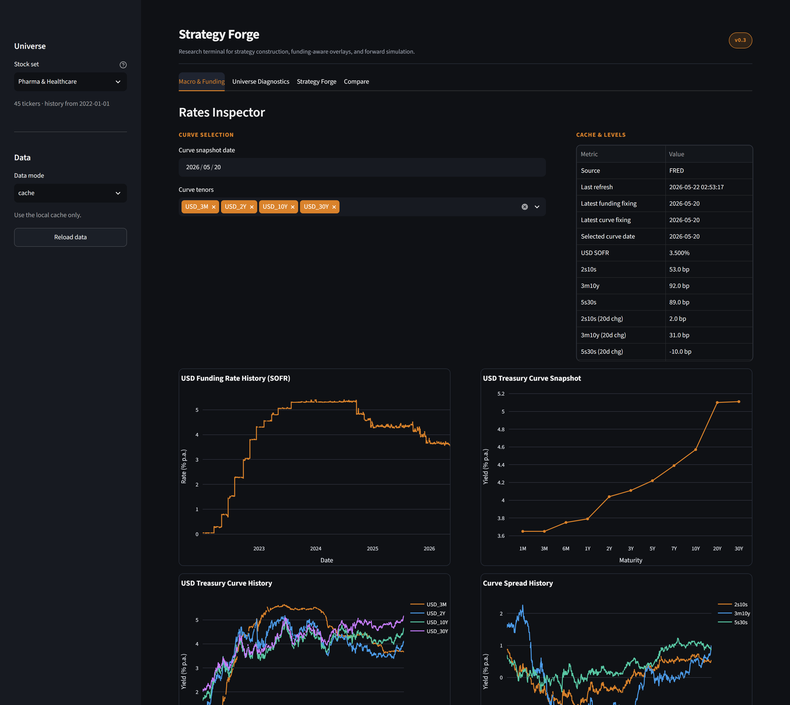
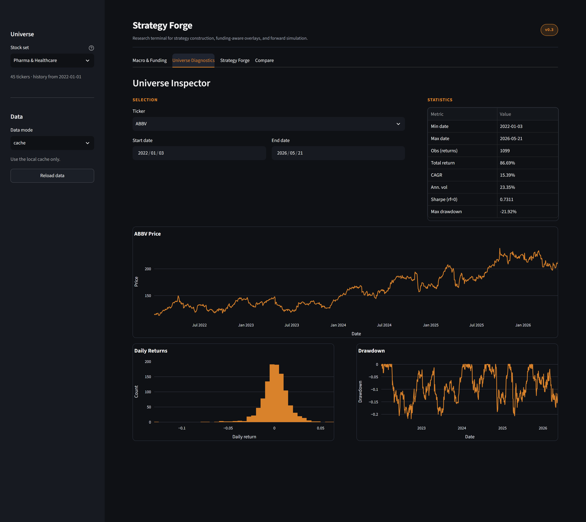
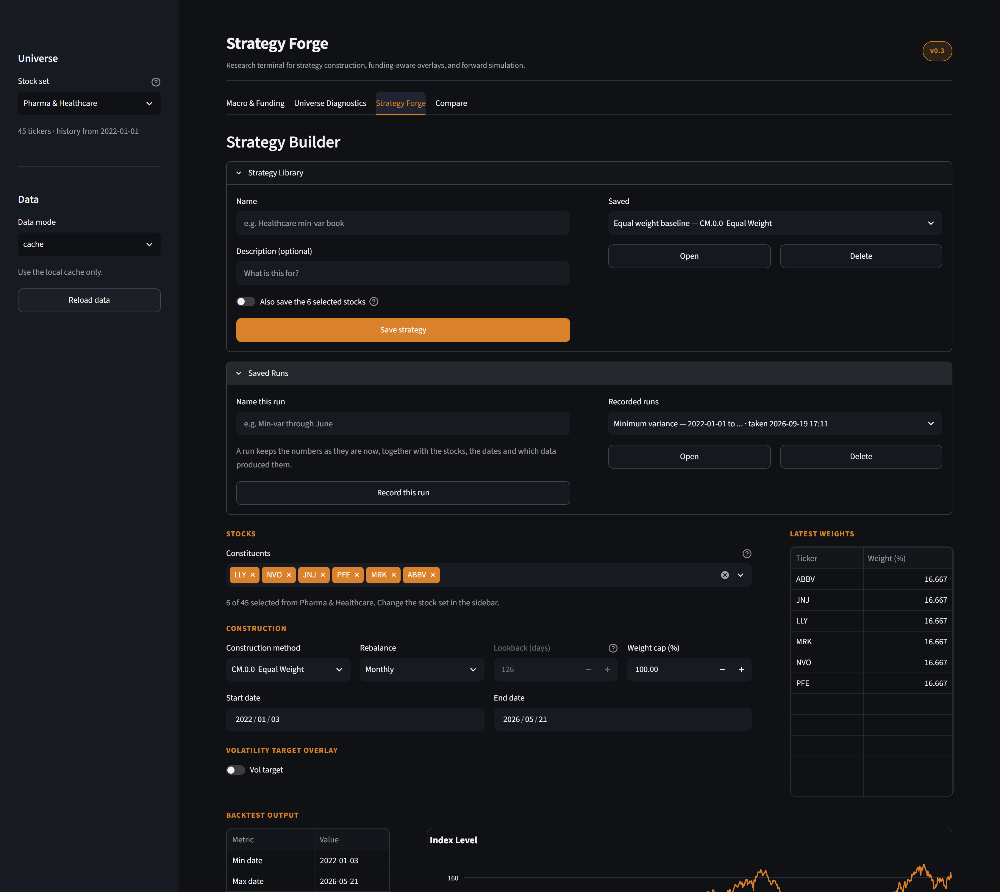
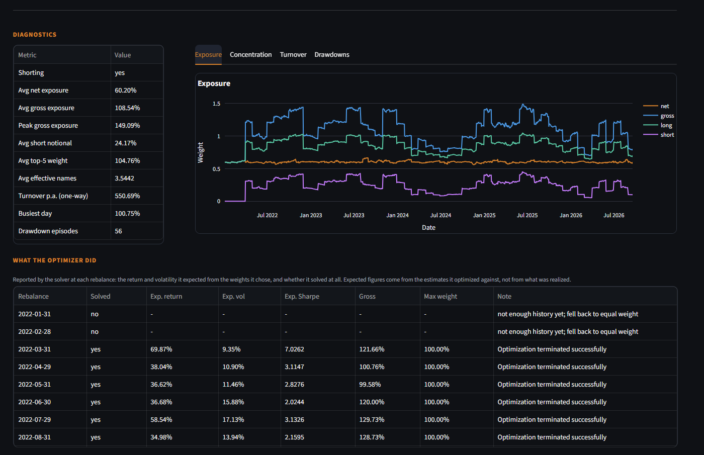
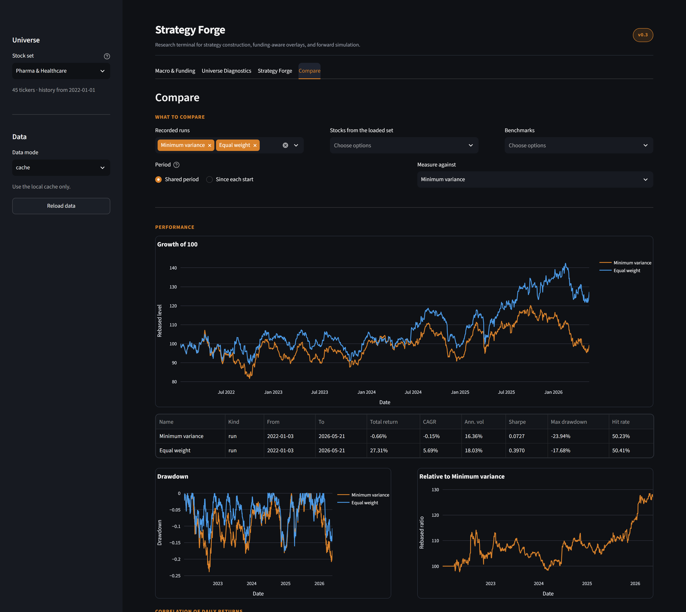
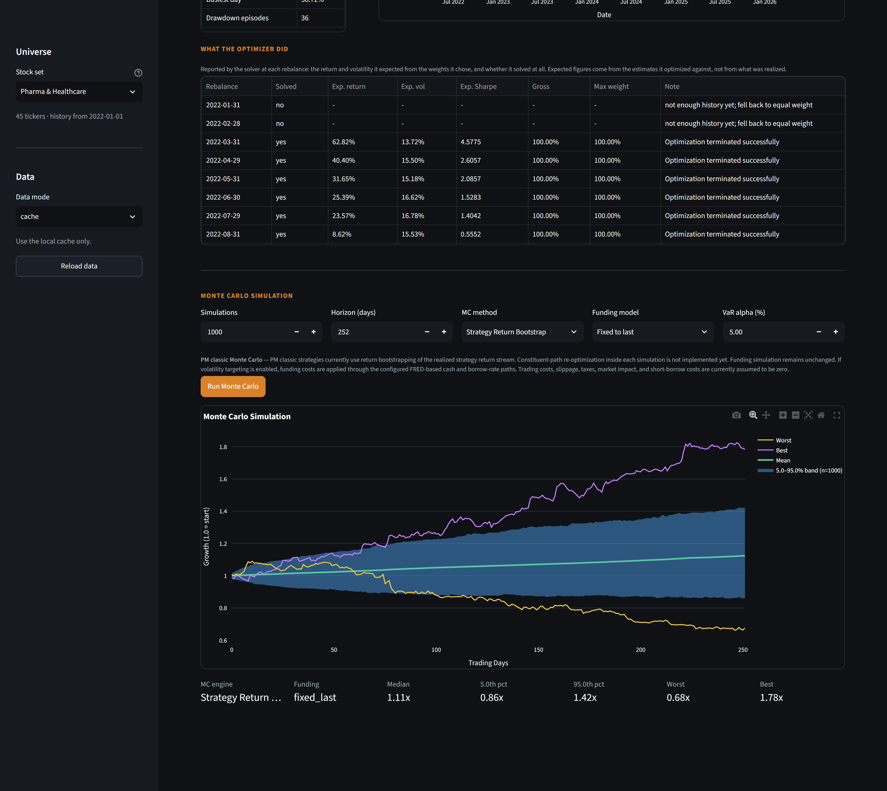

# Strategy Forge

A Streamlit research terminal for building systematic equity strategies, saving
them, re-running them, comparing them, and working out why they behaved the way
they did.

It covers passive construction rules and the PM classics, funding-aware
volatility targeting, forward simulation, and a persistence layer that separates
the logic of a strategy from any one execution of it.

Repository: <https://github.com/CalaveraJack/portfolio_balancing>

---

## 🚀 Quick start

### 1) FRED API key

The rates data and the funding-aware overlay come from FRED.

- Create an account at <https://fred.stlouisfed.org/> and generate a key
- Put it in a `.env` file:

```bash
FRED_API_KEY=your_api_key_here
```

`.env` is gitignored. Treat the key like a password and never commit it.

### 2) Install

```bash
uv venv
uv sync
```

### 3) Run

```bash
uv run streamlit run app.py
```

Open the URL Streamlit prints (by default <http://localhost:8501>).

### Data mode

A sidebar control, not a command-line flag:

| Mode | Behaviour |
| --- | --- |
| `refresh` | Fetch fresh data, update the cache, fail loudly on API errors. The error says when a usable cache exists. |
| `cache` | Never call external APIs; read the local cache only. |
| `auto` | Fetch fresh data, fall back to the cache if that fails. |

**Reload data** clears the caches and reloads under the selected mode.

---

## 🧭 The four tabs

| Tab | What it is for |
| --- | --- |
| **Macro & Funding** | SOFR history, the USD Treasury curve, curve snapshots and spreads |
| **Universe Diagnostics** | One stock at a time: price, return distribution, drawdown, statistics |
| **Strategy Forge** | Build, save, backtest, diagnose and simulate a strategy |
| **Compare** | Recorded runs, single stocks and benchmarks side by side |





### Stock sets

The sidebar picks which stocks are loaded. Three ship with the app:

| Set | Names |
| --- | --- |
| Pharma & Healthcare | 45 |
| Mega-cap Core | 10 |
| Diversified + ETFs | 21 |

Switching reloads the data and clears selections made against the previous set,
since they are not valid against the new one.

Stock sets are identified internally by a stable key, never by the name on
screen, so a label can be reworded without orphaning anything saved against it.
Definitions live in `index_lib/config/universes.py`.

---

## 🧩 Building a strategy



### Construction methods

#### Passive rules

- Equal Weight
- Cap Weight
- Price Weight
- Inverse Volatility

#### PM classics

- Minimum Variance
- Risk Parity / ERC
- Maximum Sharpe
- Maximum Diversification

Optimizers run **long-only or long/short**. Long/short exposes net exposure,
maximum gross exposure and a short-borrow cost. Note that a book with net and
gross exposure both at 100% cannot short at all: shorting requires gross above
net.

Covariance estimators: **sample**, **EWMA**, **Ledoit-Wolf**, **OAS**.

### Rebalancing and constraints

Rebalance daily, weekly, monthly or quarterly. Weights drift between rebalances.

Constraints available: a construction-level weight cap with automatic
redistribution, a per-method maximum weight, a minimum weight, and the
exposure limits above. Where the construction cap and the method maximum
disagree, the stricter of the two binds.

Not yet available: per-name short-side caps.

### Funding-aware volatility targeting

An optional overlay that scales the whole strategy return stream without
touching the construction weights:

- λ < 1 — the uninvested part earns the cash rate
- λ > 1 — the borrowed part pays SOFR plus your borrow spread

You set the target volatility, the volatility lookback, minimum and maximum
leverage, and the borrow spread.

---

## 💾 Saving your work

Three different things can be kept, and the difference between them is the point.

### Strategy

Construction logic only — method, rebalance, constraints, covariance estimator,
overlay settings. It carries **no stocks and no dates**, so the same logic can be
re-run on any stock set over any period.

### Portfolio

The same logic **plus the stocks you picked**. Reopening one restores the stock
set as well, switching the sidebar if needed.

Saving with or without the stocks is a toggle beside the Save button, and the
button says which one you are about to do. A portfolio naming a stock that has
since left the data loads the rest and tells you which one it dropped.

### Run

One historical execution: the logic, the stocks, the dates, **the results**, and
which data produced them. A run is a record rather than a definition — it is
never edited, and reopening it shows the numbers exactly as they were.

If the price data has been refreshed since a run was recorded, the app says so
and offers a choice with the cost of each stated:

- **Re-run** picks up corrections and any history added since, but the figures
  move, so anything you concluded from that run may change.
- **Keep it** preserves the record and keeps it comparable with other runs of the
  same vintage, but it may rest on data that has since been corrected and it
  stops at the older end date.

Everything is written under `saved_strategies/` as JSON and parquet, on your
machine only — the folder is gitignored.

---

## 🔬 Diagnostics

Alongside the performance statistics, every backtest reports:

- **Exposure** — net, gross, long and short over time. Net and gross coincide for
  a long-only book and separate as soon as it shorts.
- **Concentration** — weight in the top five positions, the Herfindahl index, and
  the effective number of equally weighted holdings (its reciprocal).
- **Turnover** — one-way, halved because every sale funds a purchase.
- **Drawdowns** — the deepest episodes with start, trough, recovery and depth.
- **What the optimizer did** — for the PM classics, what the solver reported at
  each rebalance: the return and volatility it expected from the weights it
  chose, its gross exposure, the maximum weight that bound, and whether it solved
  at all.

Those expected figures come from the estimates the optimizer worked with, not
from what was realized. They say what it was aiming at, not what it achieved.



---

## ⚖️ Comparison

A benchmark is a role, not a type. A recorded run, a single stock and an index
ETF are all a named series of levels, so any of them can sit on either side of a
comparison.

Align over the **shared period**, which is like for like, or **since each start**,
which shows full track records but over different market environments.

Outputs: rebased growth, drawdowns, a performance table (CAGR, volatility,
Sharpe, maximum drawdown, hit rate), relative performance against a baseline you
choose, and the correlation of daily returns.

The built-in benchmarks:

| Group | Tickers |
| --- | --- |
| Broad market | SPY, QQQ, IWM, ACWI |
| Sectors | XLK, XLV, XLF, XLY, XLP, XLE, XLI, XLB, XLU, XLRE, XLC |
| Factor & style | MTUM, QUAL, USMV, VLUE, SIZE |
| Other assets | TLT, IEF, GLD, DBC |

These are downloaded on demand. In `cache` mode only those already cached are
available, and the app names the ones that need a refresh.

Comparison works on **recorded runs**, so record a run before comparing it.



---

## 🎲 Monte Carlo simulation

Forward simulation that respects the construction method, simulating asset
returns, rebalancing, weight drift, volatility targeting and the funding overlay.



### Engines, by construction method

**Passive rules** (Equal, Price, Inverse Volatility) — constituent block
bootstrap, or correlated GBM.

**Cap Weight** — constituent block bootstrap only. It samples historical
constituent-return rows together with the aligned historical market-cap rows at
simulated rebalance dates, which keeps the cap state tied to observed market
structure rather than a static latest-cap vector. GBM is disabled here because
the engine does not simulate shares outstanding, corporate actions or cap-rank
dynamics.

**PM classics** — strategy return bootstrap. These resample the realized strategy
return stream produced by the historical backtest, rather than re-optimizing
inside every simulated constituent path. Pathwise re-optimization is not
implemented.

### Funding

Two independent stochastic layers. The asset process is one of the engines above;
the funding process is fixed at the last observed SOFR, an OU-inspired
mean-reverting process estimated from SOFR, or a bootstrap that preserves
empirical rate shocks. Simulated funding paths can be inspected individually
against the mean.

---

## ⚙️ Methodology

### Portfolio return

$$
R_t^{port} = w_t^T r_t
$$

Names without a price on a given day are treated as **stale, not sold**: the
position is carried forward at unchanged value and keeps its place in the book,
while the day's return comes only from the names that actually priced.

### Volatility targeting

$$
\lambda_t = \frac{\sigma_{target}}{\hat{\sigma}_{t-1}}
$$

### Funding-aware overlay

$$
R_t^{VC} = \lambda_t R_t^{port} + \max(1-\lambda_t,0) \cdot r_t^{cash} - \max(\lambda_t-1,0) \cdot r_t^{borrow}
$$

### GBM

$$
x_t = \log(1 + r_t)
$$

$$
x_t^{sim} = (\mu - 0.5 \cdot diag(\Sigma)) + L z_t
$$

$$
r_t^{sim} = e^{x_t^{sim}} - 1
$$

### Bootstrap

Block sampling:

$$
r_{t_1}, \ldots, r_{t_1+L-1}, r_{t_2}, \ldots
$$

### Cap-weight bootstrap

At simulated rebalance dates:

$$
w_{i,t}^{cap} = \frac{MCAP_{i,t}}{\sum_j MCAP_{j,t}}
$$

If every sampled market cap is unavailable for a simulation row, that row falls
back to equal weight.

### Diagnostics

$$
\text{net} = \sum_i w_i \qquad \text{gross} = \sum_i |w_i| \qquad \text{HHI} = \sum_i w_i^2
$$

$$
\text{turnover}_t = \tfrac{1}{2} \sum_i |w_{i,t} - w_{i,t-1}|
$$

---

## 📦 Data and caching

| Source | What | Cache |
| --- | --- | --- |
| Yahoo Finance | Close and volume | `data/*.parquet` |
| Yahoo Finance | Market caps, sector metadata | `data/*.parquet` |
| FRED | SOFR and the Treasury curve | `data/*.parquet` |

### Known approximations

**Market caps are approximate.** They are historical close × *current* shares
outstanding, which ignores issuance and buybacks. Cap-weighted backtests inherit
that.

**Fundamentals are not point-in-time.** Sector metadata is fetched but not yet
surfaced; no other fundamentals are used.

In `cache` mode nothing is fetched, and any missing market-cap values are treated
as unavailable, which can become zero in cap-weight calculations. The loaded
panel is trimmed to dates where at least one of the selected names actually
priced, so a stock set refreshed less recently reports its true range rather than
the range of the whole cache file.

---

## 🗂 Project layout

### Engine

Framework-free, so it can be driven from a notebook or a script:

```text
index_lib/strategy.py      validated strategy / overlay / MC configuration
index_lib/runner.py        backtest and Monte Carlo runners
index_lib/datasets.py      data loading and the loaded panels
index_lib/library.py       saved strategies and portfolios
index_lib/runs.py          saved runs
index_lib/diagnostics.py   exposure, concentration, turnover, drawdowns
index_lib/compare.py       comparables and comparison statistics
```

Nothing here imports Streamlit, and a test enforces it.

### Core mechanics

```text
index_lib/core/backtest.py                      index construction loop
index_lib/core/weighting.py                     weighting rules and caps
index_lib/core/rebalancing.py                   rebalance calendars
index_lib/core/overlays.py                      volatility targeting
index_lib/portfolio/optimization.py             PM-classic optimizers
index_lib/portfolio/covariance.py               covariance estimators
index_lib/simulation/                           funding paths, strategy bootstrap
index_lib/vectorization_utilities/              vectorized MC engines
index_lib/config/universes.py                   stock sets and benchmarks
```

### Interface

`app.py` is the entry point. The UI layer only renders:

```text
index_lib/ui/cache.py       Streamlit caching in front of the runner
index_lib/ui/session.py     session state and how it maps onto the controls
index_lib/ui/macro.py       Macro & Funding tab
index_lib/ui/universe.py    Universe Diagnostics tab
index_lib/ui/forge.py       Strategy Forge tab
index_lib/ui/comparison.py  Compare tab
index_lib/ui/figures.py     Plotly figure builders
index_lib/ui/tables.py      summary tables
index_lib/ui/theme.py       page chrome, stylesheet, Plotly template
```

---

## ✅ Tests

90 tests, none of which need network access — they run against the local cache.

```bash
uv run pytest
```

They cover the storage layers, the diagnostics and comparison maths, and the app
itself end to end through Streamlit's `AppTest`: saving and reopening strategies,
portfolios and runs, switching stock sets, and the comparison tab.

Screenshots are generated from the running app, so they cannot drift from it:

```bash
uv run python -m playwright install chromium   # once
uv run python scripts/screenshots.py
```

It starts the app on its own port, seeds a couple of saved strategies and runs so
the library and comparison views have something to show, captures each view, and
removes the demo work afterwards.

Before a release:

```bash
uv run ruff check index_lib app.py tests
uv run ruff format --check index_lib app.py tests
uv run pytest
uv run streamlit run app.py
```

---

## 📜 Version log

### 2026-09-19 — v0.3

Streamlit interface replacing Dash; selectable stock sets; saved strategies,
portfolios and runs; strategy diagnostics and optimizer reporting; comparison
against runs, stocks and benchmarks.

Also fixed: a one-day gap in a stock's prices was liquidating that holding and
sharing its weight among the others until the next rebalance.

### 2026-05-26

PM classics and method-aware Monte Carlo

### 2026-05-17

Release cleanup: core / app / data separation

### 2026-05-16

Caching modes and cap-weighted balancing

### 2026-03-28

Funding-aware overlay and Monte Carlo funding

### 2026-03-18

Rates inspector

### 2026-03-01

Vectorized Monte Carlo

### 2026-02-20

Equal-weight correction

---

## 📌 Status

A research prototype. Backtests assume no trading costs, no slippage, no taxes
and no market impact; short-borrow cost is modelled only where noted.

v0.3 set out to make the object model solid — what a strategy *is*, how it is
stored, how one execution is compared with another — before adding more on top.
What comes next builds on it: company fundamentals, market regimes, factor
strategies, trend following, and sector and factor attribution.
